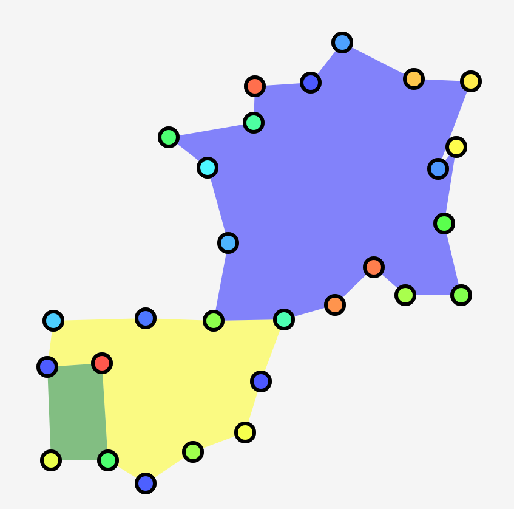
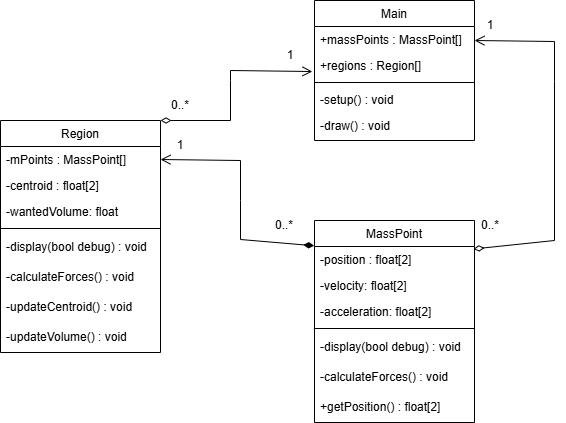

# B4 Programming - Individual Final Project
My individual final project is an animated cartogram that shifts based on changing values of the thematic variable. 

The thematic variable is intended to be population, but the simulation will support any number of other things (economy, immigration).

I'm modelling the map distortions by defining regions as a polygon of points, and moving those points based on the Dougenik technique.

## Cartogram Description
This project is intended to be used in a European history class to show how Europe's population changed throughout the ages.

Here is an example image of a world cartogram:

As you can see, a cartogram is just a map that has distortions to increase/decrease the area of certain places to show a variable.

In this case, the variable is population, but it could show crime rate, productivity, dairy exports, or literally anything else.

This variable is called the thematic variable.

## Dougenik Method
I intend to use the Dougenik method for cartograms. This is because using kinematics to adjust the regions makes it suited for animation.

Each region will push/pull on each of its points based on whether the real volume is bigger or smaller than the region wants.

Fine-tuning a single map is what the method is normally used for, but it could easily be adapted to suit an animated map, which is what I want.

## Mockup

## Class Diagram

